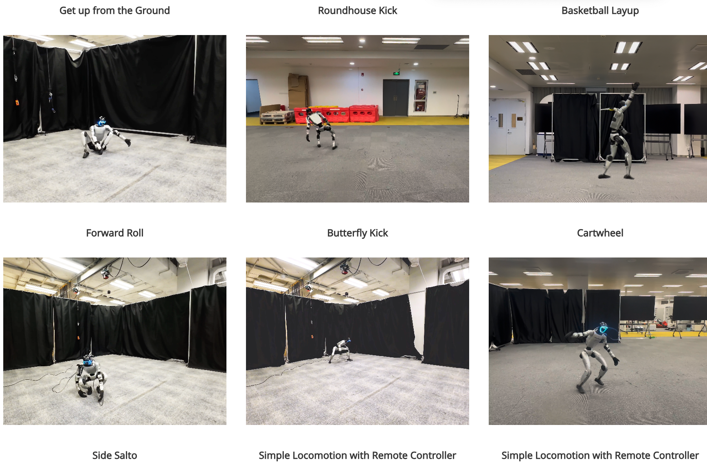
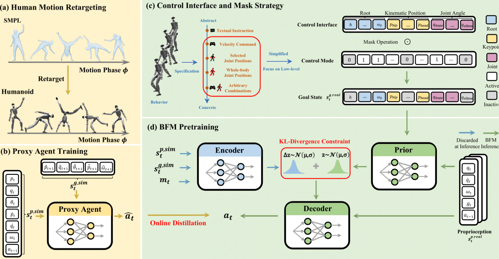
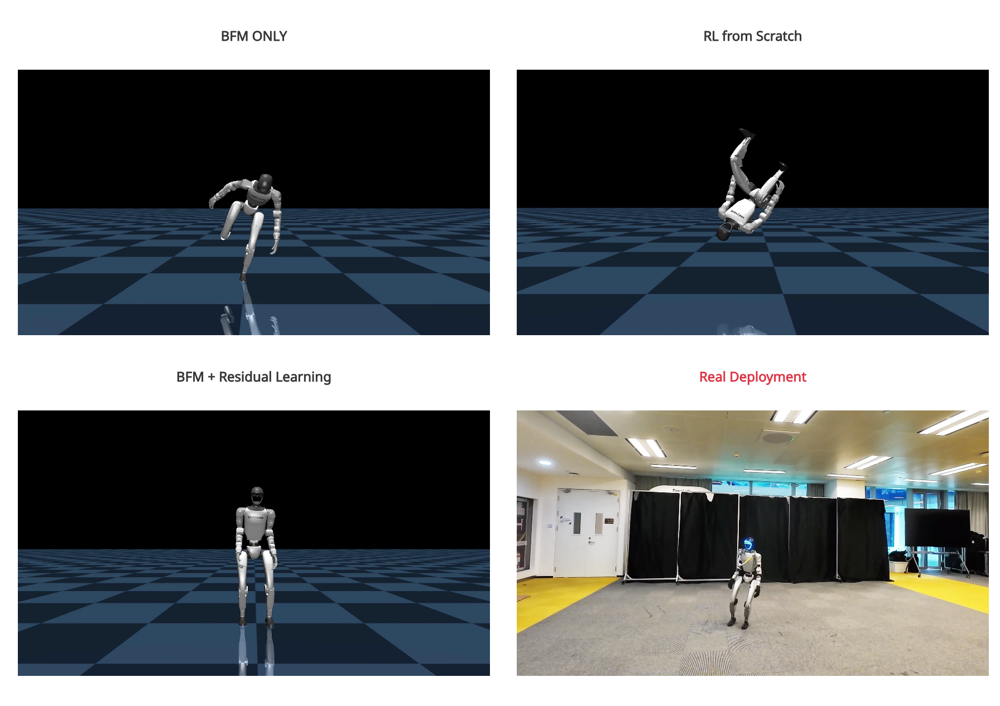
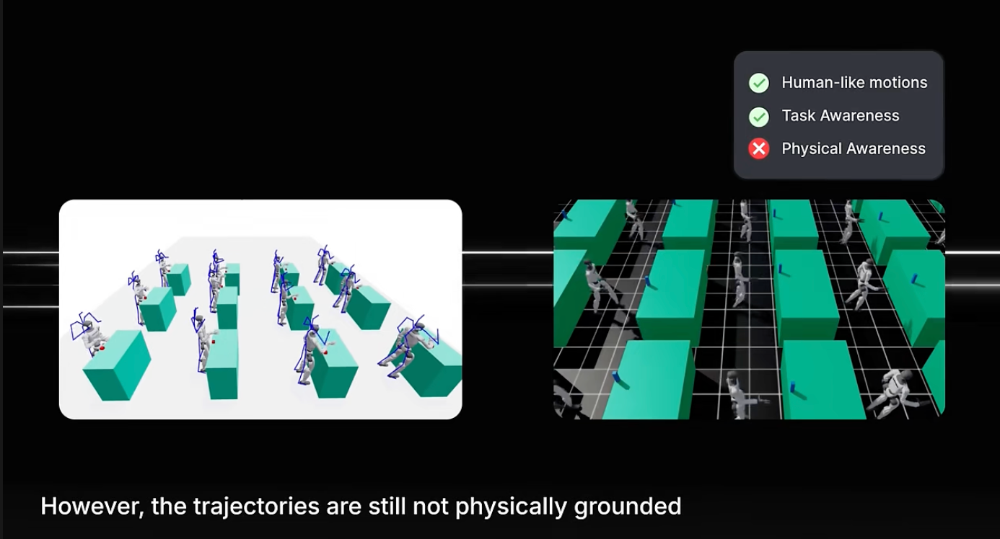
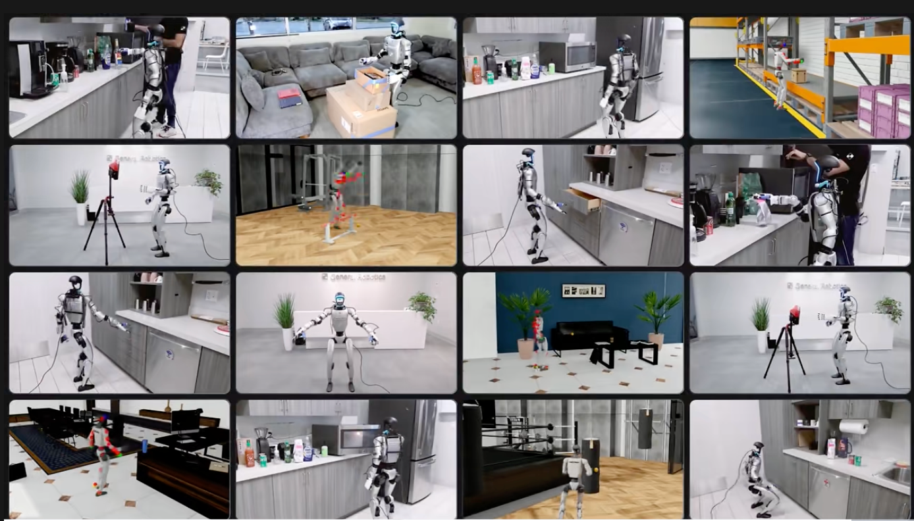

# 🤖 Behavior Foundation Model for Humanoid Robots

휴머노이드 로봇 분야에서 주목할 만한 **최신 연구 두 편**을 소개합니다.  
AI와 로봇 기술이 어떻게 결합되어 **실용적인 로봇 제어**로 발전하고 있는지를 보여주는 획기적인 연구입니다.

---

## 📌 논문 1: BFM4Humanoid (Behavior Foundation Model for Humanoids)

- 🔗 [공식 페이지](https://bfm4humanoid.github.io/)
- 📜 [논문 링크 (arXiv)](https://arxiv.org/abs/2509.13780)
  

### 🌟 핵심 기여

- **통합 행동 제어 모델(BFM)**을 통해 하나의 모델로 다양한 휴머노이드 작업 수행 가능
- 걷기, 물건 잡기, 균형 잡기 등 기존에 개별 설계되던 작업을 **단일 모델**로 통합
- → "로봇 제어의 GPT"와 같은 역할을 목표로 함

### 💡 주요 특징

- **전신 제어 관점 (Whole-Body Control, WBC)** 에 기반
- 여러 작업을 **하나의 학습된 행동 공간**에서 처리
- 단일한 모델로 다양한 태스크 수행 → 범용성 확보

### ✅ 왜 중요한가?

- 고객 입장: **더 똑똑하고 유연한 로봇** 등장 가능성
- 연구자 입장: 단일 작업 데모를 넘어서 **실제 제품화** 가능한 제어 기술로 진화

---

## 📌 논문 2: DreamControl – 생성형 모델 기반 로봇 제어 (Generative Model Driven Humanoid Control)

- 📜 [공식 블로그](http://www.generalrobotics.company/post/dreamcontrol-building-humanoid-ai-skills)
- 📰 [논문 PDF](https://genrobo.github.io/DreamControl/static/paper/DreamControl_arxiv.pdf)

### 🌟 핵심 기여

- **Diffusion 모델 + 강화학습(RL)**을 결합한 **로봇 행동 학습 방식**
- 전체 훈련은 시뮬레이션에서 수행 → 실제 휴머노이드 로봇(G1)에서 성공적으로 적용

### 💡 주요 특징

- 인간과 유사한 **자연스러운 동작 학습**
- 다양한 고난도 작업 수행:
  - 문 열기
  - 물건 잡기
  - 양팔 협업
  - 점프, 킥 등
- **클라우드 + 엣지 하이브리드 인프라**로 실시간 제어 구현

### ✅ 주요 의의

- **생성형 AI 기반 로봇 제어**의 가능성 실증
- 시뮬레이션 → 실제 로봇 전이(Sim2Real)의 **성공 사례**

> 🔑 핵심 요약: `Diffusion + RL → 자연스러운 로봇 스킬 학습`

---

## 🔑 정리 및 공유 포인트

### 📍 메인 포커스

- `BFM4Humanoid`는 **범용 로봇 제어**를 위한 획기적인 프레임워크입니다.
- GPT가 텍스트를 혁신한 것처럼, BFM은 **로봇 행동 제어의 패러다임 전환**을 이끕니다.

### 📍 보조 포커스

- `DreamControl`은 **최신 생성형 AI 기술**을 실제 로봇 제어에 **성공적으로 적용한 사례**입니다.
- 기술적 실현 가능성을 넘어서 **제품화에 가까운 성과**를 보여줍니다.

---

